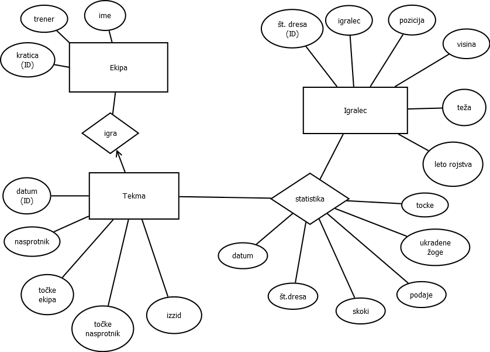

# Baza za kosarkarsko ekipo

Avtorja:
* Blaž Dobravec
* Dimitar Stoilkov

Seminarska naloga pri predmetu **Podatkovne baze 2**

## Opis

Baza bo hranila podatke o košarkaški ekipi Miami Heat, njihovih igralcih, njihovih točkah, poziciji, ipd. Baza bo namenjena evidenci uspešnosti vsakega od igralcev na bodisi posamezni tekmi, bodisi v celotni sezoni. Tabela je sestavljena iz podatkov iz prejšnje NBA sezone. Končni izdelek bo spletna storitev.

## Funkcionalnost
Končna storitev bo vključevala:

* Izpisovala podatake o določenem igralcu.
* Izpisovala najboljšega igralca na posamezni tekmi.
* Izpisovala igralce po posameznih kategorijah.
* Izpisovala tekme med dvema datumoma.
* Izpiše podatke, ko je ekipa igrala proti neki drugi določeni ekipi.
* Imela bo možnost povprečje, kjer boš lahko izbral nekatera povprečja (npr. povprečje točk igralca na sezono ipd.)

## ER diagram

